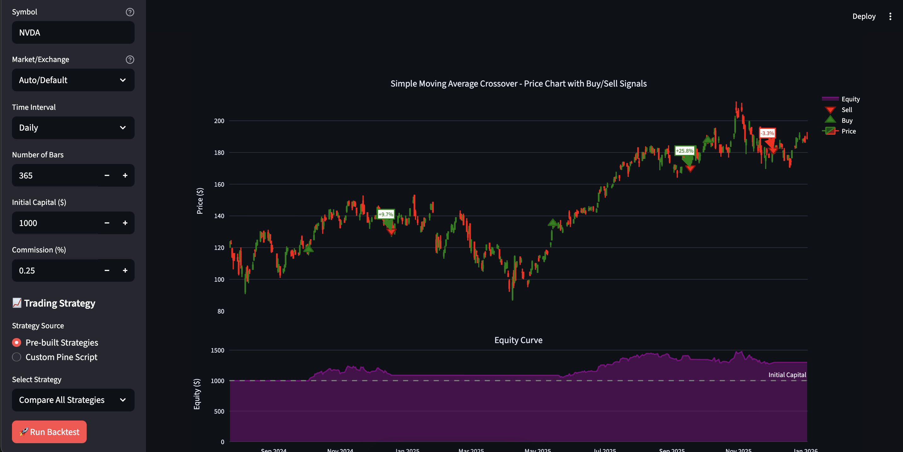

# TradingView Backtest System

A Python-based backtesting system that fetches historical data from TradingView and tests trading strategies.

## Screenshots



*Interactive web interface showing strategy comparison, performance metrics, and buy/sell signals on candlestick charts*

## Features

- **Web Interface**: Interactive web dashboard with smart search
- **API-based Stock Search**: Real-time autocomplete (no API key required!)
  - Search by symbol or company name
  - Auto-detects exchange (NASDAQ, NYSE, BINANCE)
  - Supports stocks and crypto
- Fetch data from TradingView using tvDatafeed library
- Simple custom backtesting engine
- Multiple pre-built strategies with indicators:
  - Simple Moving Average Crossover (SMA)
  - RSI (Relative Strength Index)
  - Bollinger Bands Mean Reversion
  - MACD (Moving Average Convergence Divergence)
  - Stochastic Oscillator
  - EMA Crossover (Exponential Moving Average)
  - Multi-Indicator Strategy (RSI + MACD + EMA combined)
  - Buy and Hold
- **Detailed Summary**: Comprehensive performance metrics including:
  - Performance metrics (ROI, annualized return, profit/loss)
  - Trade statistics (win rate, profit factor)
  - Win/Loss analysis (average, largest trades)
  - Position metrics (hold time, trade returns)
  - Risk metrics (Sharpe ratio, volatility, max drawdown)
- Interactive charts with buy/sell signals
- Visual equity curve with annotations

## Setup

### 1. Create and activate virtual environment

```bash
# Run the setup script
chmod +x setup.sh
./setup.sh
```

Or manually:

```bash
# Create venv
python3 -m venv venv

# Activate venv
source venv/bin/activate  # On macOS/Linux
# or
venv\Scripts\activate  # On Windows

# Install dependencies
pip install -r requirements.txt
```

### 2. Run the application

**Option A: Web Interface (Recommended)**

```bash
# Activate venv
source venv/bin/activate  # On macOS/Linux

# Run web app
streamlit run app.py
```

Then open your browser to **http://localhost:8501**

**Option B: Command Line**

```bash
# Activate venv
source venv/bin/activate

# Run interactive CLI
python main_interactive.py

# Or run automated comparison
python main.py
```

## Project Structure

```
tradingview-backtest/
├── app.py              # Web interface (Streamlit)
├── stock_search.py     # Stock/crypto search API (no key needed)
├── data_fetcher.py     # TradingView data fetcher
├── backtest_engine.py  # Custom backtesting engine
├── strategies.py       # Trading strategies
├── main.py             # Automated comparison script
├── main_interactive.py # Interactive CLI script
├── test_tsla.py        # TSLA test script
├── test_googl.py       # GOOGL verification script
├── requirements.txt    # Python dependencies
├── setup.sh            # Setup script
├── run_web.sh          # Quick web startup script
└── readme.md           # This file
```

## Usage

### Stock/Crypto Search (Web Interface)

The web interface includes a smart search feature:

1. **No API Keys Required** - Uses Yahoo Finance API (public, free)
2. **Type to search** - Enter symbol (AAPL) or company name (Apple)
3. **Auto-complete** - Shows matching stocks/crypto with exchange info
4. **Auto-detection** - Exchange is automatically set based on selection

Example searches:
- "AAPL" → Apple Inc. (NASDAQ)
- "Tesla" → TSLA (NASDAQ)
- "Bitcoin" or "BTC" → BTCUSD (BINANCE)
- "Microsoft" → MSFT (NASDAQ)

### Fetch Data

```python
from data_fetcher import TradingViewDataFetcher
from tvDatafeed import Interval

fetcher = TradingViewDataFetcher()
data = fetcher.get_data('BTCUSD', 'BINANCE', Interval.in_daily, n_bars=365)
```

### Create a Custom Strategy

```python
def my_strategy(data, index, position):
    # Your strategy logic
    if some_condition:
        return 'buy'
    elif some_other_condition:
        return 'sell'
    return 'hold'
```

### Run Backtest

```python
from backtest_engine import BacktestEngine

engine = BacktestEngine(initial_capital=10000, commission=0.001)
results = engine.run(data, my_strategy)
engine.print_results(results)
```

## Available Intervals

- `Interval.in_1_minute`
- `Interval.in_5_minute`
- `Interval.in_15_minute`
- `Interval.in_30_minute`
- `Interval.in_1_hour`
- `Interval.in_2_hour`
- `Interval.in_4_hour`
- `Interval.in_daily`
- `Interval.in_weekly`
- `Interval.in_monthly`

## Converting Pine Script Strategies

You can convert your TradingView Pine Script strategies to Python!

### Quick Start:

```bash
# Run the interactive converter
python convert_my_strategy.py
```

### Manual Conversion:

**Pine Script Example:**
```pinescript
// TradingView Pine Script
fastMA = ta.ema(close, 12)
slowMA = ta.ema(close, 26)

if ta.crossover(fastMA, slowMA)
    strategy.entry("Long", strategy.long)
if ta.crossunder(fastMA, slowMA)
    strategy.close("Long")
```

**Python Equivalent:**
```python
def my_strategy(data, index, position):
    if index < 26:
        return 'hold'

    close = data['close'].iloc[:index+1]
    fast_ma = close.ewm(span=12, adjust=False).mean()
    slow_ma = close.ewm(span=26, adjust=False).mean()

    current_fast = fast_ma.iloc[-1]
    current_slow = slow_ma.iloc[-1]
    prev_fast = fast_ma.iloc[-2]
    prev_slow = slow_ma.iloc[-2]

    if position is None:
        if prev_fast <= prev_slow and current_fast > current_slow:
            return 'buy'
    else:
        if prev_fast >= prev_slow and current_fast < current_slow:
            return 'sell'

    return 'hold'
```

See `pinescript_converter.py` for more examples and helper functions!

## Customization

Edit `main.py` to:
- Change the symbol, exchange, or interval
- Modify initial capital or commission
- Test different strategies
- Add your own custom strategies (including converted Pine Script!)

## Dependencies

- tvDatafeed: Fetch data from TradingView
- pandas: Data manipulation
- numpy: Numerical calculations
- matplotlib: Plotting equity curves (CLI)
- streamlit: Web interface
- plotly: Interactive charts
- requests: API calls for stock search

## Notes

- **No API keys required** - Stock search uses Yahoo Finance (public API)
- tvDatafeed is an unofficial library and may have rate limits
- For premium TradingView features, you can pass credentials to `TradingViewDataFetcher(username, password)`
- The backtesting engine uses simple position sizing (95% of available capital per trade)
- Initial capital can be as low as $1
